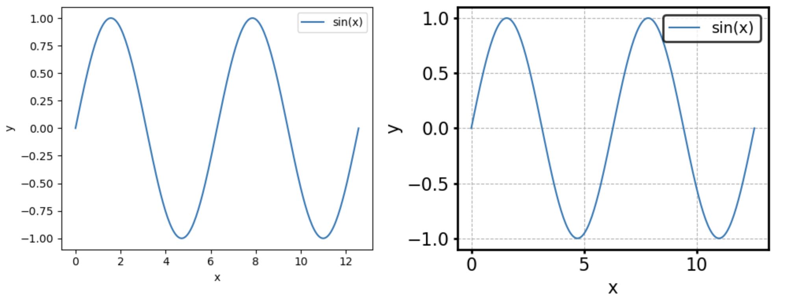

# Simple library for making plots tidy

Matplotlib's `plt.subplots` makes it very easy to work with plots as object-oriented abstractions. This library lets you format `axes` objects to make them look more tidy with a simple one-line addition to your code.

## Installation

You can clone this repository

```
git clone https://github.com/atharva-kelkar/tidyplot.git # Replace with SSH URL if you use SSH
```

Then install with

```
cd tidyplot/
pip install .
```

You can also directly install without explicitly cloning the git repo by using

```
pip install git+https://github.com/atharva-kelkar/tidyplot.git
```

## Example usage

```
import matplotlib.pyplot as plt
from tidyplot.plotting import load_default_params, format_plot

x = [1, 2, 3]
y = [2, 3, 4]
fig, ax = plt.subplots()

ax.plot(x, y)
ax = format_plot(ax, 'x', 'y')
```

If you want to change defaults, you can either load them using `load_default_params` and access them

```
kwargs = load_default_params('x', 'y')
print(kwargs.keys())
ax = format_plot(ax, **kwargs)
```

Or pass them directly to `format_plot`

```
ax = format_plot(ax, 'x', 'y', want_grid=1)
```

## Example of formatting

Below you see a simple plot before (default generated by matplotlib) and after (after formatting `tidyplot`)


